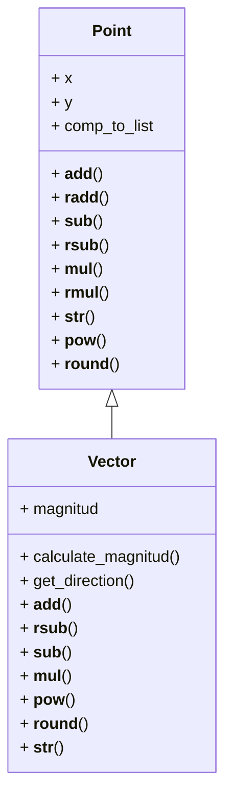

<figure>  
<figcaption><b></b></figcaption></figure>

# diagrama vector 

```mermaid
classDiagram
direction TB
      class Point {
      + x
      + y
      + comp_to_list
      + __add__()
      + __radd__()
      + __sub__()
      + __rsub__()
      + __mul__()
      + __rmul__()
      + __str__()
      + __pow__()
      + __round__()
    }

    class Vector {
      + magnitud
      + calculate_magnitud()
      + get_direction()
      + __add__()
      + __rsub__()
      + __sub__()
      + __mul__()
      + __pow__()
      + __round__()
      + __str__()
    }

    Point <|-- Vector
```