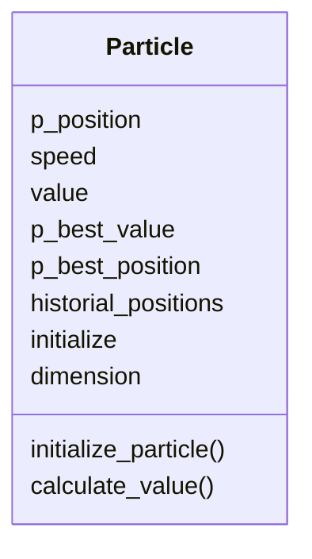
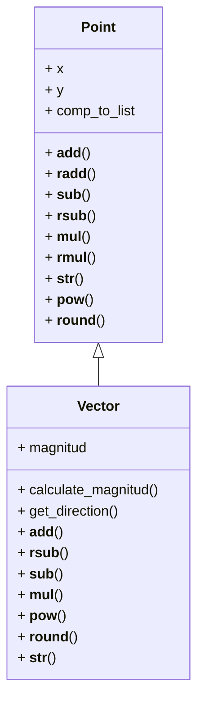
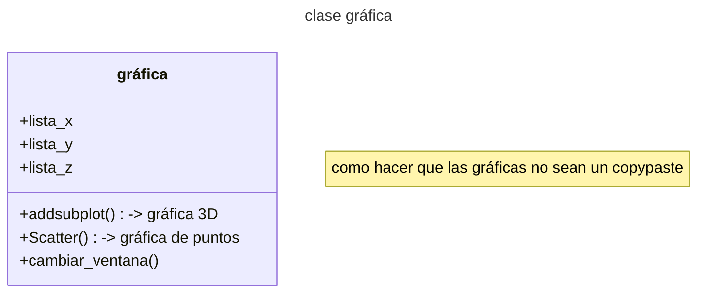

# Hola, bienvenidos a nuestro repositorio

<figure>  
<figcaption><b></b></figcaption></figure>

## diagrama de clase particle

Cosas pendientes por hacer:
* optimizar codigo y hacerlo presentable

## diagrama de clase vector

Cosas pendientes por hacer:
* dormir bien
* hacer que los enjambres puedan recibir diferentes funciones
* hacer que los enjambres devuelvan las listas X,Y,Z para gráficar
* Crear la clase de gráfica
* revisar si matplotlib puede 

## diagrama de clase graficar

