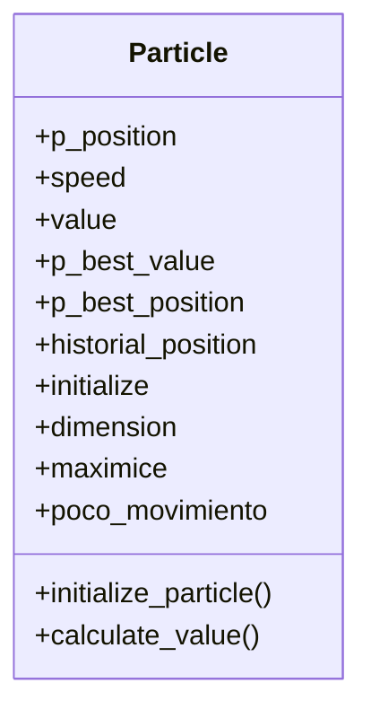
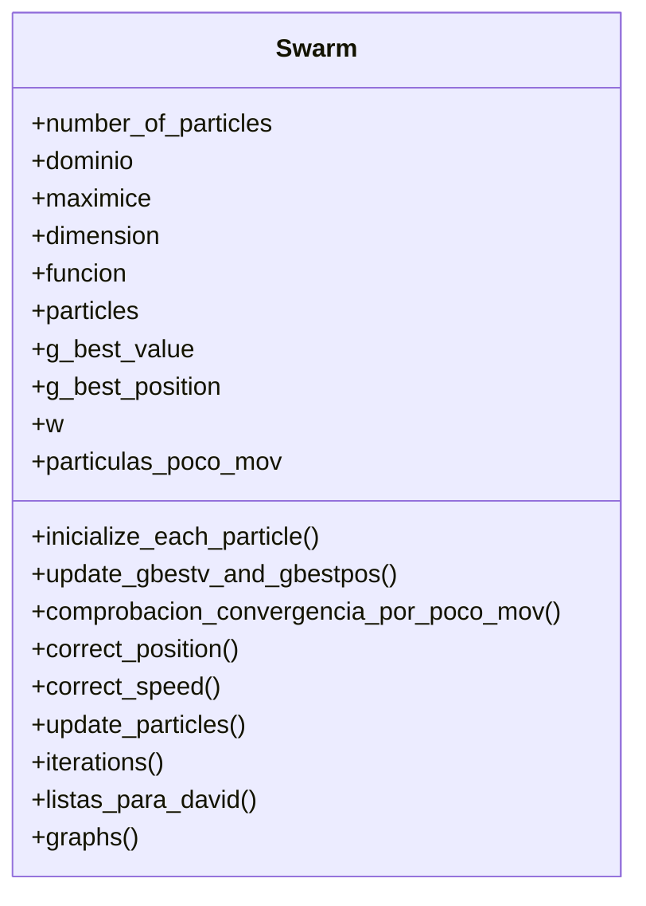
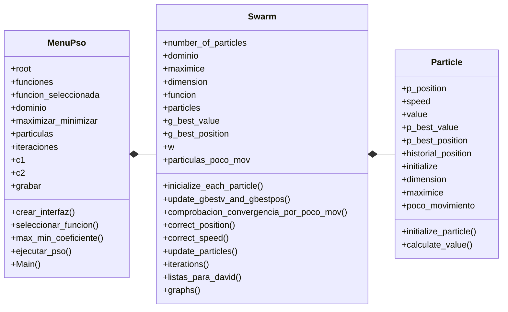

# PSO in python by ERROR 418

<div align='center'>
<figure> </br>
<figcaption><b></b></figcaption></figure>
</div>

integrantes: Kevin Javier Gonzalez Luna, Iván Felipe Maluche Suárez, David Alejandro Montes Rodríguez.

## Descripción del procedimiento:
### Algoritmo del pso
El Particle Swarm Optimization (PSO) es un algoritmo computacional metaheuristico, es decir; que finaliza con una solución lo suficientemente buena para el problema que se busca optimizar. 

El alma del PSO es un enjambre de partículas (como lo indica su nombre), en el cual muchas partículas buscan una posición objetivo (que puede ser bien o un máximo o un mínimo) a través de multiples iteraciones. El PSO funciona especialmente bien en el caso de que se tengan problemas que no se puedan modelar mediante funciones diferenciables.

El comportamiento del PSO se puede entender de la siguiente manera:

1. Se inicia el enjambre con `n` partículas
2. Se evalua cada partícula en la función objetivo
3. Se toma para cada partícula: 
    - Su mejor evaluación
    - La evaluación de la partícula con mejor evaluación.
    - La mejor evaluación del enjambre
    - 
4. Se actualiza en cada iteración la velocidad para cada partícula empleando la siguiente fórmula:

```vi(t+1)= wvi(t)+c1r1[^xi(t)- xi(t)]+c2r2[g(t) - xi(t)```

En dónde:
* vi(t+1): velocidad de la partícula i en el momento  t+1, es decir, la velocidad que obtendrá la partícula:
  
* vi(t): velocidad de la partícula  i en el momento  t, es decir, la velocidad al momento de evaluar l partícula.

* w: coeficiente de inercia, reduce o aumenta a la velocidad de la partícula.

* c1: coeficiente cognitivo. (modifica)

* r1: vector de valores aleatorios entre 0 y 1 de longitud igual a la del vector velocidad.
  
* ^xi(t): mejor posición en la que ha estado la partícula i hasta el momento.

* xi(t): posición de la partícula  i en el momento  t.

* c2: coeficiente social.

* r2: vector de valores aleatorios entre 0 y 1 de longitud igual a la del vector velocidad.

* g(t): posición de todo el enjambre en el momento t. (el mejor valor global)

5. Se repite el proceso hasta satisfacer un criterio de finalización ( por ejemplo basado en la diferencia de posiciones de las partículas pasado cierto tiempo).

*nota: En algunas variantes del PSO para algunas funciones no es posible usar este algoritmo como aquí se presenta ya que hay zonas de las funciones en la que se puede falsear que la partícula este en un mínimo o máximo, para evitar eso estas variantes implementan cierto componente de azar en la velocidad cada ciertas iteraciones.

Para implementar el PSO en python se emplea el paradigma de programación orientada a objetos (POO), ya que se desea aplicar el PSO a varias funciones.

En primer lugar se crea la clase partícula (Particle) con los siguientes atributos:

### Diagrama de clase Particle


Ya teniendo la clase partícula, se hace necesario crear la clase Swarm (enjambre de partículas) ya que esta es sobre la que se va a aplicar el PSO. De esta resalta la posibilidad de instanciar las partículas en un momento inicial y actualizar cada partícula en cada iteración.
### Diagrama de clase Swarm


Dada la preferencia de tener una mejor visualización sobre la ejecución del código, también decidimos crear nuestra propia clase Vector con las operaciones básicas de estos y necesarias para modificar correctamente los atributos de cada partícula.


### Diagrama de clase Vector


Para ejecutar todo el codigo se creo una clase dedicada a encapsular las variables necesarios para ejecutar un menu interactivo por el cual el usuario sea capaz de elegir una funcion deseada junto con otras variables relacionadas (coeficientes social y cognitivo, inercia, numero de particulas e iteraciones, etc)
### Diagrama composicion de la solucion para el PSO

### Graficas
Para realizar una representacion grafica del proceso por el cual el pso encuentra los puntos maximos y minimos se hizo uso de la libreria matplotlib, la cual por medio de un metodo dedicado integrado en la clase enjambre llamado **graphs()** permite dibujar la grafica en 3D de la funcion junto con una grafica de calor en la que se pueda ver claramente como las particulas recorren la funcion en el dominio.
Para esto la clase enjambre por medio del metodo **iterations()** y el metodo **listas_para_david** envia los datos de la iteracion actual de tal forma que por medio de los metodos propios de la libreria los datos puedan ser interpretados como coordenadas y valores los cuales son graficados.
<div align='center'>
<figure> </br>
<figcaption><b></b></figcaption></figure>
</div>
